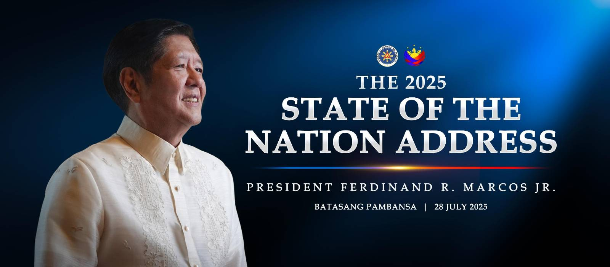

# Take on SONA July 2025 of Pres. Ferdinand R. Marcos Jr.
#### by Mavie Gale Cruz, 9 - Beryllium

---

[Watch the SONA 2025 here!](https://www.youtube.com/live/e4ElkoJEYgQ?si=nYpmV0uhD3QE-vMa)

#### Key Points I Found Interesting:
- Marcos announced the **$20-per-kilo rice program** via Kadiwa centers and warned traders against price manipulation.
- The **PhilHealth kidney transplant coverage** will now fully cover patients' transplant costs.
- **Public school teachers** will receive compensation for overload and overtime work this school year.
- Marcos acknowledged public frustration and emphasized improving **government services** faster and better.

#### Key Points I Found Weird:
- Marcos **publicly scolded** the LTO during the SONA for license plate backlogs.
- The emphasis on **opening sports ovals** for jogging seemed oddly timed for a national address.
- The **flood control kickback** comment felt sudden and could have used more specifics.

The SONA that happened this 2025, focused a lot on meeting basic needs, especially through programs that target food and healthcare. The ₱20-per-kilo rice plan through Kadiwa centers stood out as a direct response to rising prices, and it shows that the government is trying to make food more affordable for everyone. The announcement that PhilHealth will now cover kidney transplants also felt important, since medical expenses are a big burden for many Filipinos. These programs, if done well, could actually bring relief to people who need it most.

Another strong point in the speech was how it acknowledged flaws in government services. Mentioning the LTO backlogs and giving attention to public school teachers’ overtime showed that some real problems are being noticed. The President also talked about budget honesty and even called out corruption in flood control projects, which added to the message of accountability. While not everything was fully explained, the speech gave a clearer view of the government's current priorities and what it wants to improve.

---

#### Message for the Philippines:
> *"Steady progress, but only if promises are kept."*

---

